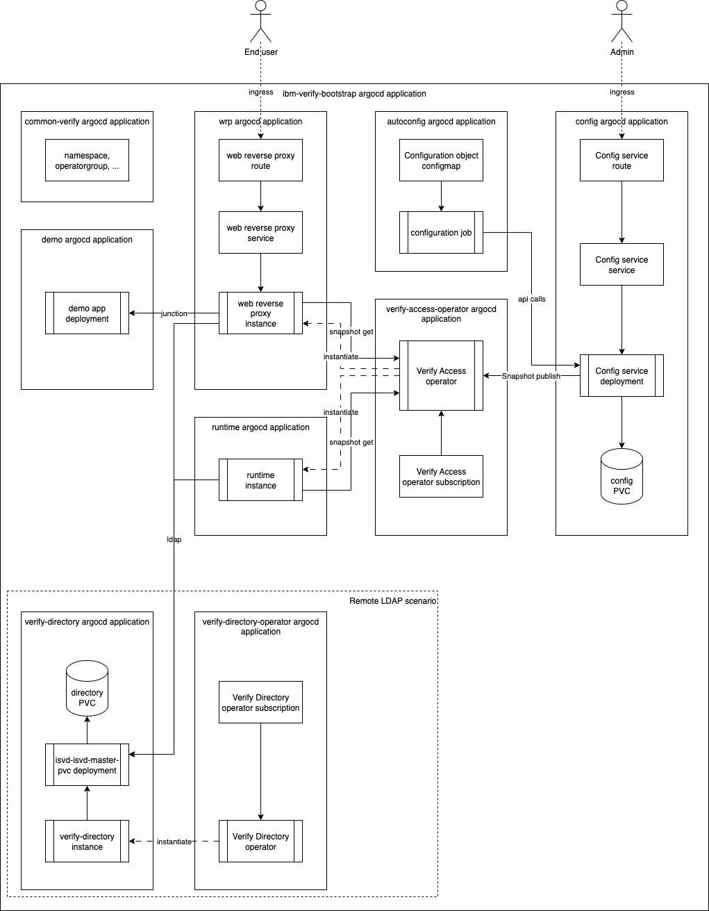

# ibm-verify-gitops

GitOps for IBM Verify Access

## Overview



This repository is using argo CD (or Red Hat Openshift Gitops) to create the operators needed for deploying IBM Verify Access, instatiating a basic runtime and web reverse proxy connected to the provided demo application. argo CD assumes Red Hat Openshift Gitops so if using other version namespace for argo CD applications/roles would need to be changed.

Automation is done using the [ibmvia_autoconf](https://lachlan-ibm.github.io/ibmvia_autoconf) Python library.

## LDAP

There are several options provided in this repo:

- Using local (embedded) LDAP
- Using remote LDAP with the provided openldap image part of verify access
- Using remote LDAP with IBM Verify Directory

See [config directory](components/autoconfig/base/config/config.yaml) for different examples. Current configuration is using IBM Verify Directory.

## Running in restricted-v2 SCC

In Openshift, `restricted-v2` SCC is the default security context constraint and also required in may environements. The configuration service is currently not supporting this mode (see [this idea](https://ibmsecurity.ideas.ibm.com/ideas/ISAM-I-1108) for details). An unsupported workaround is added here by changing from `deployment-anyuid.yaml` to `deployment-restricted.yaml` in [kustomize.yaml for the config service](components/operands/verify-access/config/base/kustomization.yaml).

Note that local user registry (embedded LDAP) is not possible to use in that case and a remote LDAP needs to be used. And of the two remote LDAP options provided in this repo, only verify directory can run in `restricted-v2` mode.

## Installation

### Prerequisites

argo CD or Red Hat Enterprise Gitops needs to be installed in the cluster.

### Steps

### Create the project


#### Create secret with passwords and activation keys

Literals that is not added to the git repo needs to be added in a secret. Replace the values marked with `<>` in the command below (here using Openshift CLI).

`ldap-binddn` is `cn=root` for IBM Verify Directory and `cn=root,secAuthority=Default` for openldap (local or remote).

```bash
oc create -n ibm-verify secret generic ivia-secrets \
 --from-literal=aac-code=<AAC activation code> \
 --from-literal=base-code=<base activation code> \
 --from-literal=fed-code=<federation activation code> \
 --from-literal=cfgsvc-passwd=<configuration service password> \
 --from-literal=ldap-binddn=<LDAP bind dn> \
 --from-literal=ldap-passwd=<LDAP password> \
 --from-literal=postgres-passwd=<postgres password> \
 --from-literal=sec-passwd=<sec-master password>
```

For Verify Directory also add this secret:

```bash
oc create -n ibm-verify secret generic isvd-secret \
 --from-literal=admin_password=<admin password> \
 --from-literal=license-key=<license key> \
 --from-literal=replication_password=<replication password> \
 --from-file=server_cert=<server cert pem file location> \
 --from-file=server_key=<server private key pem file location>
```

#### Create the argo CD bootstrap application

Run the following command to create the argo CD bootstrap application and then follow the progress in argo CD.

```bash
oc apply -f argocd/bootstrap.yaml
```

#### Routes

To access the configuration service, use the URL from this command:

```bash
oc get route -n ibm-verify ivia-config -o jsonpath='{.spec.host}'
```

and for the web reverse proxy.

```bash
oc get route -n ibm-verify ivia-wrp -o jsonpath='{.spec.host}'
```

## Clean-up LDAP entries

Script to remove LDAP entries from verify directory created by configuration job in this repo

```bash
oc exec -n ibm-verify -i isvd-isvd-master-pvc -- bash -s < scripts/remove_ldap_entries.sh passw0rd
```
